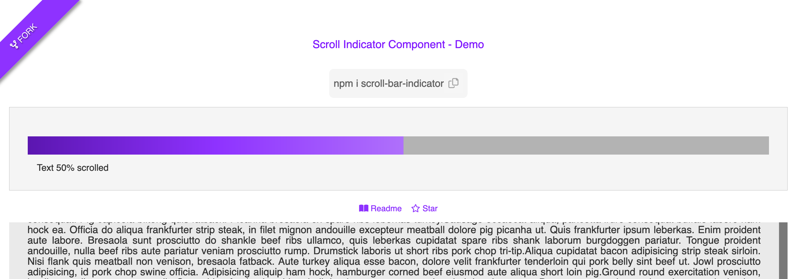

# Scroll Bar Indicator 

[](https://www.repostatus.org/#active)
[](https://opensource.org/licenses/MIT)
[](https://www.npmjs.com/package/scroll-bar-indicator)
[](https://github.com/sarahcssiqueira/scroll-bar-indicator/releases/latest)

Customizable React component for create a customizable scroll bar indicator. It shows a visual representation of the user's scrolling progress.

<p align="center">
  
</p>

See [Demo here](https://scroll-indicator-demo.sarahjobs.com)


## Installation

To install run:

`npm i scroll-bar-indicator` or 

`yarn add scroll-bar-indicator`


## Import

Import the component:

`import ScrollBarIndicator from 'scroll-bar-indicator';`

Add the component and pass your custom props:

```
    <ScrollBarIndicator
      barColor="#b3b3b3"
      barHeight = "2rem",
      indicatorColor="#8e32ff" 
      infoColor="#333333"
      showInfo={true},
      info="Page"
    />

```


## Props

| Prop                | Type                  | Default Value          | Description                               |
|---------------------|-----------------------|------------------------|-------------------------------------------|
| barColor            | String                | #b3b3b3                | Color of the scroll bar                   |
| barHeight           | String                | 2rem                   | Defines the bar height.                   |
| indicatorColor      | String                | #8e32ff                | Color of the scroll indicator             |
| infoColor           | String                | #333333                | Color of the scroll info text             |
| showInfo            | Boolean               | True                   | Whether to display the scroll info text   |
| info                | String                | Page                   | Text to display info below the component  |


## Contributing

Contributions are welcome.

- Fork the repository
- Create your feature branch (`git checkout -b feature/my-feature`)
- Commit your changes (`git commit -m 'commit message'`)
- Push to the branch (`git push origin feature/my-featuree`)
- Create a new Pull Request


## License

This project is licensed under the MIT License - see the [LICENSE](./LICENSE.md) file for details.


## Contact

Issues, suggestions, or feedback, create an [issue](https://github.com/sarahcssiqueira/scroll-bar-indicator/issues).
