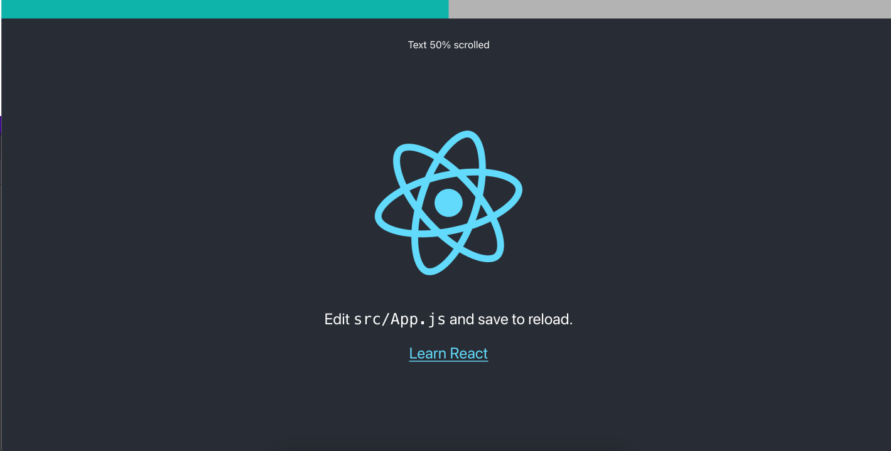

# Scroll Bar Indicator 

[](https://opensource.org/licenses/MIT)

`ScrollBarIndicator` is a customizable React component that displays a scroll position indicator.

<p align="center">
  
</p>


## Usage

### Install

To install the `scroll-bar-indicator` package, run:

`npm install scroll-bar-indicator` or 

`yarn add scroll-bar-indicator`

### Import

Import the ScrollBarIndicator in your React application:

`import ScrollBarIndicator from 'scroll-bar-indicator';`

Add the component with your custom props.

```
    <ScrollBarIndicator
      barColor="rgb(200, 200, 200)"
      barHeight = "2rem",
      indicatorColor="rgb(14, 179, 170)" 
      infoColor="rgb(51, 51, 51)"
      showInfo={true}
    />

```

### Props

To customize, use the props below into the ScrollBarIndicator:

- `barColor` (string): Background color of the scroll bar. Default is `rgb(179, 179, 179)`.
- `barHeight` (string): Defines the bar height. Default is `2 rem`.
- `indicatorColor` (string): Background color of the scroll indicator. Default is `rgb(14, 179, 170)`.
- `infoColor` (string): Color of the scroll info text. Default is `rgb(51, 51, 51)`.
- `showInfo` (boolean): Whether to display the scroll info text. Default is `true`.

## License

MIT